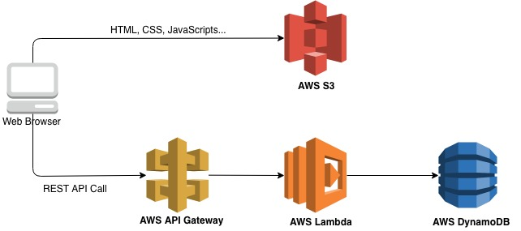
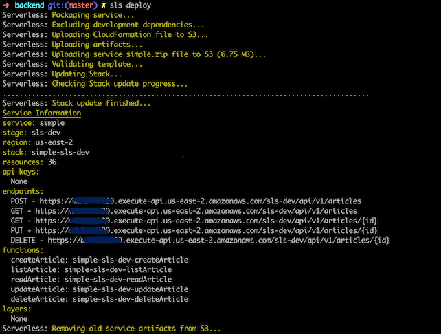
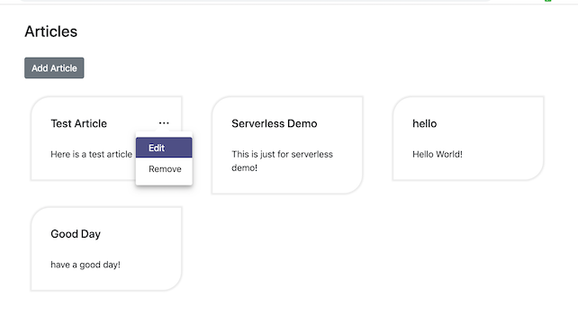
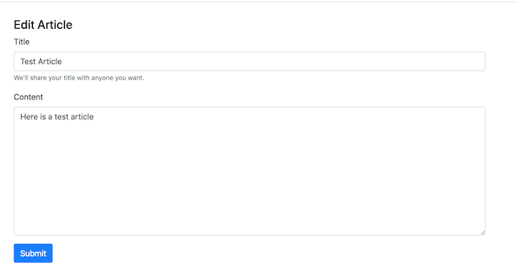

# **SPA with Serverless REST API example**

This example demonstrates how to build a CRUD Single Page Application (SPA) with serverless framework. It includes the following AWS Services:

- AWS S3
- AWS API Gateway
- AWS Lambda
- AWS DynamoDB

The high level architecture is as below:



## **Deployment**

### **Prerequisite**
To go through this example you will need following:

- AWS account
- Node.js
- AWS CLI and configure it

### **Backend deployment**
1. Make sure you have serverless installed
```bash
$ npm install serverless -g
```

2. Setup AWS Credentials with serverless config credentials command
```bash
$ serverless config credentials --provider aws --key <your_aws_key> --secret <your_aws_secret>
```

3. Install the package dependencies 
```bash
$ cd backend
$ npm install
```
4. Update the variables with your AWS Account ID and AWS Region in the serverless.yml file
```yml
custom:
  #our vars
  aws_account_id: <your AWS ID>
  aws_region: <Your AWS Region>
```

5. Deploy all with the serverless framework



You can get all the API endpoints in the deploy log output as above screenshot. The endpoint will be used in the frontend deployment.

### **Frontend deployment**
1. Make sure you already install angular cli https://cli.angular.io/
	
	```bash
	npm install -g @angular/cli
	```

2. Install the package dependencies 
```bash
$ cd frontend
$ npm install
```   
3. Update the API endpoint in the src/environments/environment.prod.ts file

```ts
export const environment = {
  production: true,
  backendAPI: 'https://***********.execute-api.us-****-*.amazonaws.com/sls-dev/api/v1'
};

```

4. Compile the frontend Angular app
```bash
$ ng build --prod --aot=true
```   
5. Copy the files in the dist/articles/ to your AWS S3 bucket which hosts the static website.
You can refer to the following example on the AWS official site.

[Example: Setting up a Static Website](https://docs.aws.amazon.com/AmazonS3/latest/dev/HostingWebsiteOnS3Setup.html)


### **Deployment Validation**

Visit your website's base URL (if you need to lookup the base URL, visit the S3 console, select your bucket and then click the Static Web Hosting card on the Properties tab.), you should see the simple CRUD pages as displayed. 
 

